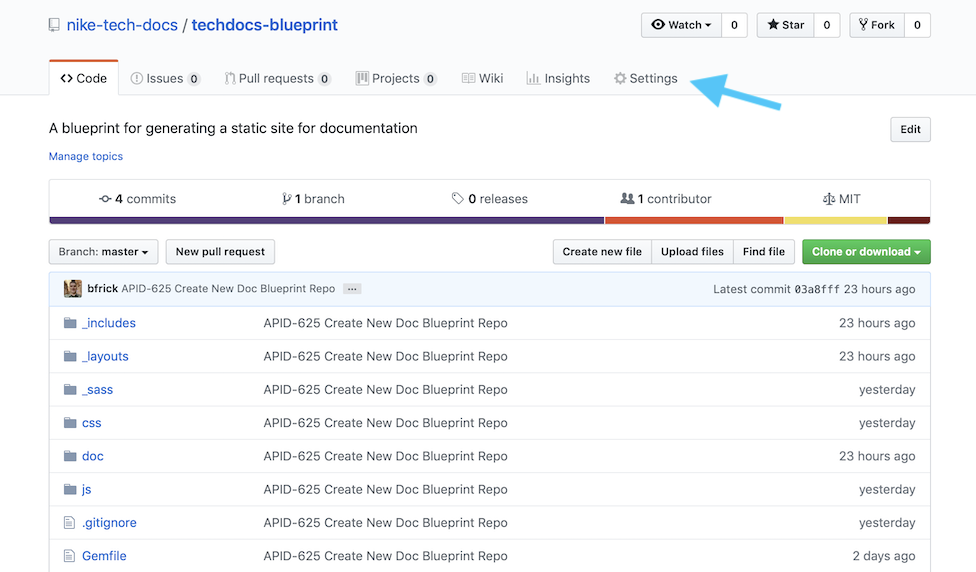
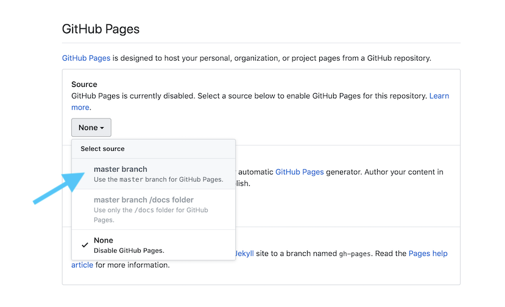
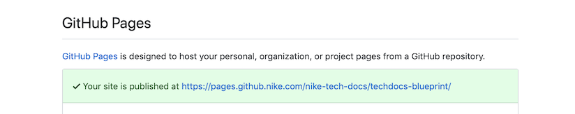

# Blueprint Guide

---

Use this blueprint repository to create your own internal documentation site at Nike and host it on GitHub Pages. Try out the [Blueprint Site](https://pages.github.nike.com/nike-tech-docs/techdocs-blueprint/) or the [Knowledge Base Demo Site](https://pages.github.nike.com/nike-tech-docs/blueprint-demo/index.html) now!

## Table of Contents

- [Overview](#overview)
- [Quick Start](#quick-start)
- [Blueprint Basics](#blueprint-basics)
- [Making the Site Your Own](#making-the-site-your-own)

## Overview

If you're on a software development team at Nike, and want an easy way to publish docs about your product, you're in the right place!

### Who Should Use This?

This might work for you, if you have a preference for:

- Treating [Docs as Code](https://www.writethedocs.org/guide/docs-as-code/), writing docs and code with the same tools
- Using [Git](https://git-scm.com) for source control of docs
- Writing in [Markdown](https://www.markdownguide.org)
- Easy, free hosting with GitHub Pages

### Features

This repo generates a documentation site via the [Jekyll](https://jekyllrb.com) static site generator. It only takes a few minutes to get it [up and running](#quick-start) on your local.

Here are some of its advanced features and benefits:

- Full-text keyword search via [Lunr.js](https://lunrjs.com)
- Persistent navigation sidebar with links to all docs
- Doc table of contents that auto-highlights headings as you scroll
- Styling via [NCSS](https://tourguide.prod.commerce.nikecloud.com/ncss) and custom styles
- Markdown templates to get you started writing
- Works seamlessly with GitHub Pages. [View the demo!](https://pages.github.nike.com/nike-tech-docs/techdocs-blueprint/)

This blueprint was born from the [doc site](https://developer.niketech.com/commerce-docs) created by the [Tech Docs](https://confluence.nike.com/display/APID/Commerce+Docs) team for the [Nike Developer Portal](https://developer.niketech.com). We think we've solved many of the common problems with doc sites, and we want to pass that along to you.

>**TIPS**:
> - You will probably not find all these features in the built-in GitHub Pages themes. That said, if you don't need all the extra goodness, consider using GitHub Pages with a built-in theme.
> - Check out our [Knowledge Base Demo Site](https://pages.github.nike.com/nike-tech-docs/blueprint-demo/index.html) to see if it works for you.

### Hosting Options

The static site generated with this blueprint is designed to work seamlessly with GitHub Pages, but it can be hosted wherever you like. Be aware, though, that using a different hosting option will require some extra work in reconfiguring this repo.

Here is a breakdown of what we believe are two good hosting options:

|Option|Cost|Notes|
|---|---|---|
|GitHub Pages|FREE!|Easy and quick setup with default pages.github.com domain. Supports custom domains|
|AWS|Less than 1k per year|More time and effort to set up S3 and Route 53. Requires some reconfiguration of this blueprint. Supports custom domains|

## Quick Start

Follow these steps to install the required tools, and run the default site on your local machine. Unless otherwise noted, run all commands in the terminal from the repo's root. This should take about 15 minutes or less.

**1. Clone the Blueprint Repo**

Clone this repo to your local machine with Git using your text editor or IDE of choice and one of the following links:

SSH: `git@github.nike.com:nike-tech-docs/techdocs-blueprint.git`

HTTPS: `https://github.nike.com/nike-tech-docs/techdocs-blueprint.git`

**2. Install the Homebrew Package Manager**

`/bin/bash -c "$(curl -fsSL https://raw.githubusercontent.com/Homebrew/install/HEAD/install.sh)"`

**3. Install the Ruby Language**

`brew install ruby`

**4. Add the Brew Ruby Path to Your Shell Config**

```zsh
# If you're using Zsh
echo 'export PATH="/usr/local/opt/ruby/bin:$PATH"' >> ~/.zshrc

# If you're using Bash
echo 'export PATH="/usr/local/opt/ruby/bin:$PATH"' >> ~/.bash_profile

# Unsure which shell you are using? Type
echo $SHELL
```

**5. Install Bundler and Jekyll**

`gem install --user-install bundler jekyll`

**6. Run the Jekyll Content Server**

`bundle exec jekyll s`

**7. Open the Site**

Navigate in your browser to http://localhost:4000/nike-tech-docs/techdocs-blueprint/index.html to view the default site!

Next, we'll learn more about [Blueprint Basics](#blueprint-basics).

## Blueprint Basics

Learn the basics of how to use this blueprint.

### Navigating the Default Site

Here's some info about the navigation structure of the default site.

#### Landing Page

The default [landing page](http://localhost:4000/nike-tech-docs/techdocs-blueprint/index.html) is a template comprised of a title, banner, and a series of "tiles" for grouping set of links to your docs.

#### Sidebar

The persistent sidebar on the left of the page has multiple features:

- A 'Docs Home' link, used to return to the landing page from wherever you are
- A 'Search' field for full keyword search of your docs 
- A nested list of all docs on the site, grouped by category (e.g. Guides)
- A table of contents for the selected doc, with auto-highlight on scroll

>**TIP**: We'll discuss more about [Modifying the Landing Page](#modifying-the-landing-page) and [Modifying the Sidebar](#modifying-the-navigation-sidebar) later.

### Understanding the Folder Structure

Here is a breakdown of the folder structure of the doc site, relative to the repo's root.

|File/Folder|Contents|
|---|---|
|`README.md`|This document, which describes how to use the blueprint|
|`_config.yml`|The Jekyll configuration file in YAML format|
|`/_includes`|HTML snippets, reusable in Markdown or HTML files|
|`/_layouts`|HTML templates for creating pages (includes links to CSS, JS, fonts, etc.)|
|`/_sass`|CSS files referenced in files in `/css`, via [Sass](https://sass-lang.com/guide)|
|`/_site`|The destination folder where Jekyll creates the site. See [More on _site](#more-on-_site) for details.|
|`/css`|Main set of CSS files|
|`/doc`|Markdown files. Your docs go here!|
|`/images`|Image files|
|`/js`|JavaScript files|

Avoid renaming any folders that begin with `_` (e.g. `_includes`). Jekyll uses the `_` prefix to exclude those folders from its HTML conversion when building the site.

As far as modifying any of the remaining folders, most likely you will want to create new subfolders under `/docs` and `/images` to organize the files within. You can have as many nested subfolders as you want, just remember to adjust the relative links in your Markdown files to reflect the new structure.

>**TIP**: You will probably want to replace `README.md` with your own content once your site is ready to be published.

#### More on `_site`

**Jekyll Manages `_site` Automatically**

`_site` is where Jekyll automatically creates your site. Its files are intended to be managed by Jekyll, so avoid editing them manually as your changes will be overwritten.

While the Jekyll server/build process is running, any changes you make will be reflected within seconds in `/_site`, and served up automatically to http://localhost:4000/nike-tech-docs/techdocs-blueprint/index.html.

**`_site` is Excluded from Git Pushes**

Since this blueprint is intended for GitHub Pages, which does its own Jekyll build of the site, the contents of `/_site` are only needed for local testing. As such, `/_site` is in the `.gitignore` file, and is excluded when you push repo changes via Git.

If you choose another hosting option besides GitHub Pages, remove `/_site` from `.gitignore` so that those files can be pushed.

Next, let's talk about the steps for [Making the Site Your Own](#making-the-site-your-own).

## Making the Site Your Own

You've got the blueprint running locally, and now you want to start customizing it to fit your needs.

### Copy the Blueprint Into Your Repo

You'll need to decide if your docs should be in the same repo as the related code, or in a separate repo that only contains the docs.

Whatever you decide, make sure that you copy this entire blueprint to the root of your repo. Do this to avoid build errors with GitHub Pages later on, since it expects the folders to be at root.

>**TIP**: You may need to do the steps in the [Quick Start](#quick-start) from the root of your repo to install the required tools there.

### Adding New Pages with Markdown

Here are some considerations for adding your Markdown files:

- Add [Front Matter](#front-matter) to the top of all Markdown files that you want Jekyll to convert to HTML
- Use standard Markdown syntax, except when [Formatting Relative Links](#formatting-relative-links)
- Open external links in a new tab by appending `{:target="blank"}` immediately after the link: `[Link Text](your.url.com){:target="blank"}`
- Add HTML inline with Markdown as desired, it should render correctly
- Add Markdown files to the `/doc` directory by default
- Format images by default as:

```markdown

```

#### Formatting Relative Links

We think relative links should work properly, both when testing locally, and once the site published on GitHub Pages. Accomplishing this requires a slightly-modified syntax for relative links in your Markdown files.

Let's compare standard syntax to what you need to use:

**Standard Relative Link Syntax**

```markdown
This standard link to [Sample Doc 1](/doc/sample-use-case.html) will not work on GitHub Pages.
```

**Required Relative Link Syntax**

```markdown
This modified link to [Sample Doc 1]({{ "/doc/sample-use-case.html" | absolute_url }}) works on GitHub Pages!
```

Using the modified syntax, Jekyll will prepend the correct `baseurl` to the link, depending on which environment you're in.

>**TIPS**:
>- Links with URLs can have standard Markdown syntax, e.g. `[Google](https://www.google.com)`
>- Be sure to update the `baseurl` value in `_config.yml` so that relative links work correctly for your site. See [Modifying _config.yml](#modifying-_configyml) for more on that.

#### Front Matter

Front matter is a snippet of YAML that is placed between two triple-dashed lines at the start of a Markdown file.

Jekyll requires front matter to process a Markdown file into a page, so at minimum each file should have empty front matter at the top:

```
---
---

# Some Markdown
```

Front matter is used to set variables for the page. Here is the typical front matter needed for the blueprint, which is used entirely to drive the sidebar navigation:

```
---
id: sample-use-case
category: b-template
position: 2
title: Use Case Guide
url: /doc/templates/sample-use-case.html
status: active
tag: templates, use cases
toc:
  - h2: Introduction
    url: /doc/templates/sample-use-case.html#introduction
  - h2: Key Concepts & Terms
    url: /doc/templates/sample-use-case.html#key-concepts--terms
---
```

This might seem like unnecessary work, but your efforts are rewarded when your docs magically show up in the sidebar navigation, complete with a table of contents!

>**TIPS**:
>- For an explanation of the above front matter variables, see the comments at the top of `/doc/templates/use-template.md`.
>- The front matter variables are utilized in layouts and includes via the [Liquid](https://jekyllrb.com/docs/step-by-step/02-liquid/) templating language.

### Modifying the Landing Page

The main landing (i.e. home) page for the site is `/index.md`. It is a brief Markdown file with front matter, and an [include](#creating-a-new-include) statement for `/_includes/landing.html`, which contains the content of the page.

You will need to update `landing.html` to make the landing page relevant to your site. Here are some ways to do that:

#### Minimum Effort

- Update the h1 header in `<h1>Docs Landing Page</h1>` to your preferred text.
- Update the banner header `<h4>`, and banner text `<h5>`.
- Add your doc links and link text in the `<li>` tags, e.g. `<li><a href="<your doc link here>"><h5>Doc Link 1</h5></a></li>`.
- Remove any unused doc groupings (i.e. the entire contents of the `<div>`) and/or any unused list items (`<li>`) within doc groupings.

#### Partial/Full Redesign

For an entirely different landing page layout, you have several options:

- Update `landing.html` directly by updating part or all of the HTML to suit your needs
- Create a new HTML file with your own content in `/_includes`, then update the statement in `index.md` to include the new file
- Modify `index.md` to remove the HTML include statement, and add Markdown-only content

>**TIP**: Designing your landing page in HTML will give you the most flexibility in terms of layout and styling.

### Modifying the Navigation Sidebar

The navigation sidebar HTML is located in `/_includes/sidebar.html`. To make it relevant for your site, make the following changes:

- Update the Slack link in the `<a>` tag at the top, or delete the entire tag
- Update the `<h6>` ("Docs Home") to your preferred text for the landing page link
- Update the doc category names (e.g. Guides, Overviews) and icon classes (e.g. "fas fa-map") here:

    ```html
        <h6><span name="{{ sorted_cats.name}}" class="toggle"><i
                class="fas fa-cogs"></i>  Templates<i
                class="fas fa-life-ring"></i>  Get Help</span></h6>
    ```

>**TIP**: This blueprint uses icons from both [NCSS](https://tourguide.prod.commerce.nikecloud.com/glyphs#glyphs) and [Font Awesome](https://fontawesome.com/icons). It's easy and quick to update an icon by changing the class name, i.e. `<i class="<class name here>"</i>`

### Modifying `_config.yml`

The `_config_yml` contains the configuration variables that Jekyll uses to build your site.

#### Updating the `baseurl`

As referenced in [Adding New Pages with Markdown](#adding-new-pages-with-markdown), you will need to update the `baseurl` so that your relative links will work correctly both locally and on GitHub Pages.

The `baseurl` value should be formatted as follows: `/<github org name>/<github repo name/`.

Here is where to make that change in `_config.yml`:

```yaml
# ----
# Site

title: Tech Docs Blueprint
description: Jekyll site for documentation
permalink: none
url: https://pages.github.com
baseurl: /nike-tech-docs/techdocs-blueprint
```

You can choose to change the `title` and `description` if you want, but those values aren't shown anywhere on the site by default.

#### Modifying the Source/Destination Folders

You can modify the source and destination folders that Jekyll uses to build the site, by adding/changing the following lines in `_config.yml`. This is NOT recommended unless you decide to host the site somewhere other than GitHub Pages.

```yaml
# publish from a source dir to a destination dir
source: <some other folder, default is root>
destination: ./_site/
```

>**TIP**: For any other changes to `_config.yml`, refer to the [Jekyll Configuration Instructions](https://jekyllrb.com/docs/configuration/) for details of which configuration variables are allowed, and how to use them.

### Modifying the CSS

You can change the CSS to suit your needs. Most of the customizations to the Aviator theme are in `/css/doc.scss`, so that's the best place to start.

It's recommended to leave all the files in `/_sass` untouched, or to only make targeted changes to `_main.scss`. These files came with the Aviator theme, and removing them will likely break the Jekyll builds.

>**TIP**: This blueprint uses the [Aviator](http://themes.jekyllrc.org/aviator/) theme for Jekyll. While other [themes](http://themes.jekyllrc.org) exist, this blueprint is only compatible with themes with a two-column page layout like Aviator.

### Modifying the JS

All the JS files in the blueprint were added as customizations to the Aviator theme. It's unlikely that you will need to modify these files, but here is a description of each file just in case:

|JS File|Description|
|---|---|
|`lunr.min.js`|Adds search indexing via Lunr.js, included in `/search.html`|
|`main.js`|Expands/collapses sidebar section and highlights sidebar on click|
|`search.js`|Executes search, also included in `/search.html`|

### Creating a New Page Layout

In this blueprint, the default layout used by Jekyll to convert Markdown files to HTML files is `/_layouts/two-column.html`. This layout is set as the default in `_config.yml` and is used to convert any Markdown file that has front matter of any kind.

You can create new HTML layout files and save them in `/_layouts`.  To apply that layout to a Markdown file, add front matter that references the layout file name. For example, for `new-layout.html`, the front matter would be:

```
---
layout: new-layout
---
```

### Creating a New Include

'Include' files, located in `/_includes`, are HTML snippets that can be inserted into any Markdown or HTML file as it is converted by Jekyll during the build process.

To use a snippet from `/_includes`, add a statement like `` into the file at the exact location at which the HTML should be inserted.

The includes provided with the blueprint are described below:

|Include File|Description|
|---|---|
|`analytics.html`|Placeholder for adding Google analytics to the site, included in `/_layouts/two-column.html`|
|`landing.html`|The landing page for the site, see [Modifying the Landing Page](#modifying-the-landing-page)|
|`header.html`|Page header for docs based on the template `/doc/templates/sample-overview.md`|
|`sidebar.html`|Persistent left sidebar for navigation, included in `/_layouts/two-column.html`|

>**TIPS**: 
> - New includes must be saved in `/_includes`.
> - Don't recognize the syntax for inserting includes? Jekyll uses the [Liquid](https://jekyllrb.com/docs/liquid/) templating language for [Includes](https://jekyllrb.com/docs/includes/) and [Layouts](https://jekyllrb.com/docs/layouts/).

### Replacing the Favicon

To change the [favicon](https://en.wikipedia.org/wiki/Favicon), replace `/favicon.png` with a different image file of same name.

### Building and Running the Site

To build and run the site locally, start the Jekyll server from the command line:

```zsh
bundle exec jekyll s
```

Most file changes will trigger an automatic rebuild while the server is running, **except** changes to `_config.yml`. Changes to `_config.yml` will not be reflected until you restart the Jekyll server.

To restart the server, type Ctrl/Command-C to stop the server, then run the above command to start it again.

### Publishing the Site on GitHub Pages

You've made all the changes to your site, and pushed them to your repo on GitHub. To publish the site on GitHub Pages, follow these steps:

1. From the repo 'Code' view, select the 'Settings' tab:



2. Scroll to GitHub Pages section, under Source select "master branch" from the drop-down:



3. Look for the confirmation text in the green box and follow the link to your new site!



Note that GitHub Pages automatically republishes your site every time you merge to the branch in your repo that is the publishing source (i.e. in the above example, master branch).

>**TIP**: For more info, see [Choosing a Publishing Source on GitHub Pages](https://docs.github.com/en/github/working-with-github-pages/configuring-a-publishing-source-for-your-github-pages-site#choosing-a-publishing-source).

## Contributing

Did you make an improvement to this blueprint that might benefit others? Submit a PR on [GitHub](https://github.com/nike-tech-docs/techdocs-blueprint).

## Contact Us

Ask a question, report an issue, or make a feature request on Slack at [#tech-docs](slack://channel?team=T0G3T5X2B&id=C6A18NT7W).