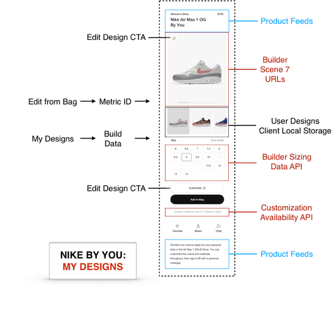

## Enable My Designs

**How do I save a design in My Designs?**

The consumer may wish to save one or more of their designs for later in My Designs.



1. **Enable My Designs**

    Add the following properties to the configuration object you are passing into the `nikeIdBuilder` function, like:

    ```javascript
    const config = {
     myDesignsEnabled: true,
     myDesignCapacity: 20
    };
    ```
    
    These two `config` properties are described below in more detail:
        
    |Property Name|Usage|Default|
    |---|---|---|
    |`myDesignsEnabled`|Value of `true` tells the Builder to enable myDesign local storage, while `false` disables it|`false`|
    |`myDesignsCapacity`|Number of most recent designs to be stored in local storage. If this maximum value is exceeded, the oldest design will be deleted from storage.|`15`|
    
    Once My Designs is enabled, when the user clicks the 'Done' button their design will be saved to the myDesigns local storage.

2. **Get a list of the consumer's My Designs**

    Call any of the following Builder or bridge methods:

    - [setAnswer](https://developer.niketech.com/docs/projects/Commerce%20Docs/Builder%20Reference/Methods#setanswer)
    - [setSizeType](https://developer.niketech.com/docs/projects/Commerce%20Docs/Builder%20Reference/Methods#setsizetype)
    - [setSizeAnswer](https://developer.niketech.com/docs/projects/Commerce%20Docs/Builder%20Reference/Methods#setsizeanswer)
    - [OnProductLoad](https://developer.niketech.com/docs/projects/Commerce%20Docs/Builder%20Reference/Methods#onproductloadbuilddata)
    - [OnDone](https://developer.niketech.com/docs/projects/Commerce%20Docs/Builder%20Reference/Methods#ondonebuilddata)
    - [getMyDesigns](https://developer.niketech.com/docs/projects/Commerce%20Docs/Builder%20Reference/Methods#getmydesigns)

    In all cases, the build data that is returned to your application includes a list of the myDesigns that have been stored for the current `pathName`, sorted from newest to oldest, like:

    ```
    myDesigns: [
       {
          imgUrl: "http://render.nikeid.com/ir/render/nikeidrender/AMax20171611_v9?obj=/s/shadow/shad&show&color=000000&obj=/s/g1&color=3a3a3a&show&obj=/s/g4&color=3a3a3a&show&obj=/s/g7&color=141414&show&obj=/s/g8&color=ffffff&show&obj=/s/g9&color=141414&show&obj=/s/g6&color=ffffff&show&obj=/s/g14&color=141414&show&obj=/s/g13&color=141414&show&obj=/s/g15&color=bcc6cc&show&obj=/s/g2&color=ffffff&show&obj=/s/g5/solid&color=141414&show&obj=/s/g10/solid&color=b7132d&show&obj=/s/g12/solid&color=141414&show&obj=/s/g17/solid&color=ffffff&show&obj=/s/g18&color=ffffff&show&obj=/s/g23&color=000001&show&obj=/s&req=object&fmt=png-alpha&icc=AdobeRGB&wid=250"
          key: "1561569449311"
          pathName: "AMax20171611_GLOW"
       },
       {
          imgUrl: "http://render.nikeid.com/ir/render/nikeidrender/AMax20171611_v9?obj=/s/shadow/shad&show&color=000000&obj=/s/g1&color=3a3a3a&show&obj=/s/g4&color=3a3a3a&show&obj=/s/g7&color=141414&show&obj=/s/g8&color=ffffff&show&obj=/s/g9&color=141414&show&obj=/s/g6&color=ffffff&show&obj=/s/g14&color=141414&show&obj=/s/g13&color=141414&show&obj=/s/g15&color=bcc6cc&show&obj=/s/g2&color=ffffff&show&obj=/s/g5/solid&color=141414&show&obj=/s/g10/solid&color=154399&show&obj=/s/g12/solid&color=141414&show&obj=/s/g17/solid&color=ffffff&show&obj=/s/g18&color=ffffff&show&obj=/s/g23&color=000001&show&obj=/s&req=object&fmt=png-alpha&icc=AdobeRGB&wid=250"
          key: "1561569431459"
          pathName: "AMax20171611_GLOW"
       }
    ]
    ```
    
    The fields in myDesigns are described below:
     
    |Field|Description|Type|
    |---|---|---|
    |`imgUrl`|A Scene7 url for view9 of the myDesign thumbnail|String|
    |`key`|The unique key associated with the myDesign|String|
    |`pathName`|The pathName associated with the myDesign|String|

3. **Manage a consumer's My Designs**

    Perform actions on My Designs by calling the following methods:

    - To load a My Design: [applyMyDesign(myDesignKey)](https://developer.niketech.com/docs/projects/Commerce%20Docs/Builder%20Reference/Methods#applymydesign)
    - To save a My Design: [saveMyDesign()](https://developer.niketech.com/docs/projects/Commerce%20Docs/Builder%20Reference/Methods#savemydesign)
    - To delete a My Design: [deleteMyDesign(myDesignKey)](https://developer.niketech.com/docs/projects/Commerce%20Docs/Builder%20Reference/Methods#deletemydesign)
    - To delete all My Designs: [deleteMyDesigns()](https://developer.niketech.com/docs/projects/Commerce%20Docs/Builder%20Reference/Methods#deletemydesigns)