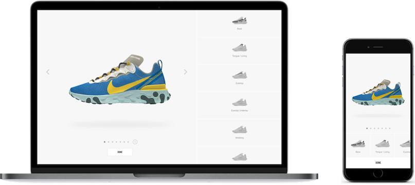
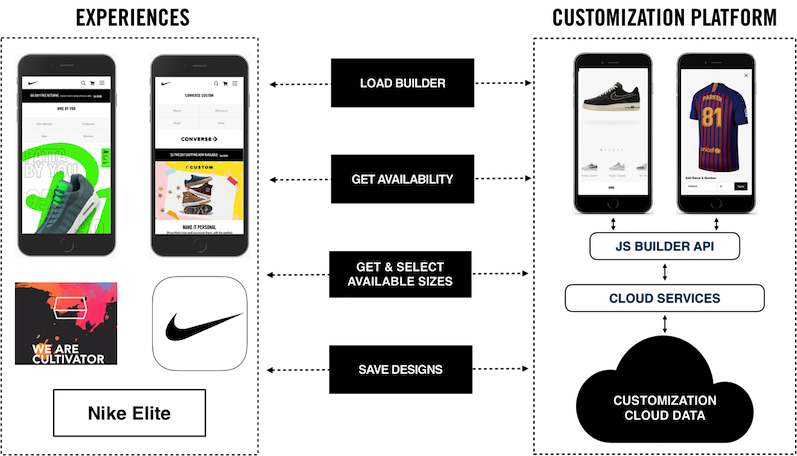
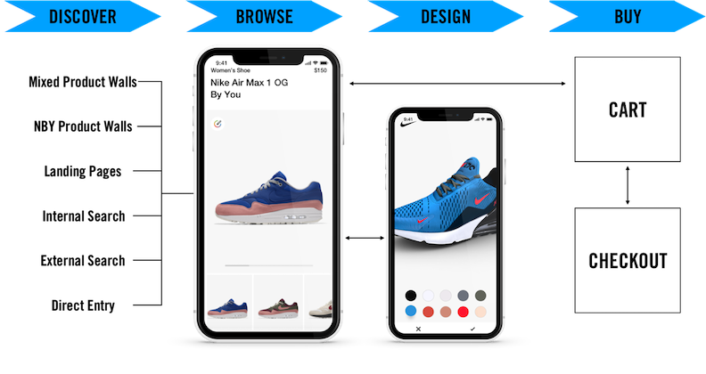
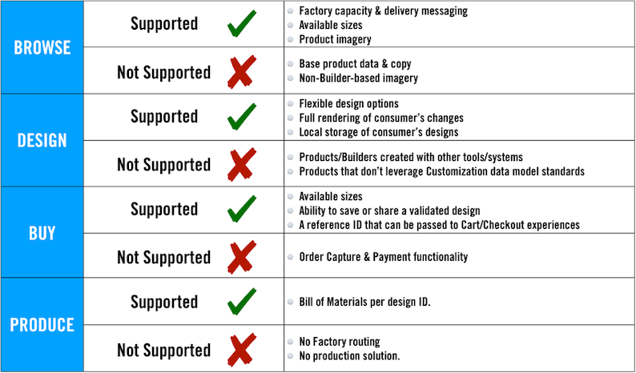

# Customization Overview

Add product customization to your experience using the [Customization Experience Platform (CXP)](https://developer.niketech.com/docs/projects/Commerce%20Docs/Customization/Using%20Customization).

### Integration Overview

[CXP](https://developer.niketech.com/docs/projects/Commerce%20Docs/Customization/Using%20Customization) is set of APIs and Components that collectively unlock your consumers' ability to [design](https://developer.niketech.com/docs/projects/Commerce%20Docs/Customization/Using%20Customization/Show%20a%20Design%20UX) and [buy](https://developer.niketech.com/docs/projects/Commerce%20Docs/Customization/Using%20Customization/Enable%20Purchasing) customized products.

### Use Cases

Here are some use cases for integrating CXP capabilities into your experience.

|Use Cases|
|---|
|[Show Customizable Products](https://developer.niketech.com/docs/projects/Commerce%20Docs/Customization/Using%20Customization/Show%20Products)|Which products are customizable? How do I start designing?|
|[Show a Design Experience](https://developer.niketech.com/docs/projects/Commerce%20Docs/Customization/Using%20Customization/Show%20a%20Design%20UX)|What customization options are available? What does my design look like? How much will it cost?|
|[Enable My Designs](https://developer.niketech.com/docs/projects/Commerce%20Docs/Customization/Using%20Customization/Enable%20My%20Designs)|How do I save a design in My Designs?|
|[Enable Purchasing](https://developer.niketech.com/docs/projects/Commerce%20Docs/Customization/Using%20Customization/Enable%20Purchasing)|Is the product available for purchase? How do I select a size? When would my design be delivered to me?|

>**TIP**: See [Adding Customization to Your Experience](https://developer.niketech.com/docs/projects/Commerce%20Docs/Customization/Using%20Customization) for full integration details.

### User Journey

### What We Provide

### Next Steps

- [Adding Customization to Your Experience:](https://developer.niketech.com/docs/projects/Commerce%20Docs/Customization/Using%20Customization) An in-depth guide on integrating with the Customization Builder.    
- [Customization Builder Reference:](https://developer.niketech.com/docs/projects/Commerce%20Docs/Customization/Builder%20Reference) The reference doc for the Customization Builder.
- [Adding Product Feeds to Your Experience:](https://developer.niketech.com/docs/projects/Commerce%20Docs/Product%20Feeds/Using%20Feeds) Discover how to integrate with Product Feeds.

### Connect

We're here to help. 

- [#Slack](https://app.slack.com/client/T0G3T5X2B/C6A18NT7W) 
- [Email](Lst-nde.docs@nike.com)