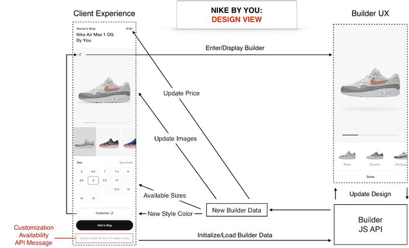

## Show a Design Experience

**What customization options are available? What does my design look like? How much will it cost?**

The consumer has selected to edit the design via the 'Edit Design' CTA, so it's time to show them the Builder UX.

#### Show the HTMLElement containing the Builder UX

- Use same Element ID you used when loading the Builder, e.g. `document.getElementById('nikeid-app')`.

#### Interact with the Builder

###### Table 3:  Builder Scenarios with Corresponding UX Interactions

|Scenario|Interaction|
|---|---|
|Load a new build, either to "reset" the builder or to switch between builds.|Invoke the [`setBuild`](https://developer.niketech.com/docs/projects/Commerce%20Docs/Builder%20Reference/Methods#setbuild) method, for example by prebuild ID or metric ID.|
|Display price changes (when customization options are changed).|Listen to the `onPriceUpdate(priceData)` bridge callback and show updated price in UX.|
|Consumer selects the 'Done' button.|Listen to the `onDone(buildData)` bridge callback, then call [`saveDesign`](https://developer.niketech.com/docs/projects/Commerce%20Docs/Builder%20Reference/Methods#savedesign) and update UX.|
|Save a build.|Invoke the [`saveDesign`](https://developer.niketech.com/docs/projects/Commerce%20Docs/Builder%20Reference/Methods#savedesign) method, which returns a metric ID for the build.|
|Edit a design that is already in the cart.|Invoke [`setBuild`](https://developer.niketech.com/docs/projects/Commerce%20Docs/Builder%20Reference/Methods#setbuild) with the metric ID you previously got from calling [`saveDesign`](https://developer.niketech.com/docs/projects/Commerce%20Docs/Builder%20Reference/Methods#savedesign).| 
|A consumer triggers an analytics event.|Listen to the `onAnalyticsEvent(type, payload)` bridge callback, then trigger an action.|
|An error occurs in the Builder.|Listen to the `onError(error)` bridge callback, handle the error and update UX.|

>**TIP**: See [Bridge Properties](https://developer.niketech.com/docs/projects/Commerce%20Docs/Builder%20Reference/Builder%20API#bridge-properties) for more.

#### Sample JavaScript

For a sample JavaScript class that shows how you might interact with the Builder, see [builderBridge.js](https://bitbucket.nike.com/projects/NID/repos/builder-experience/browse/integration/builderBridge.js).