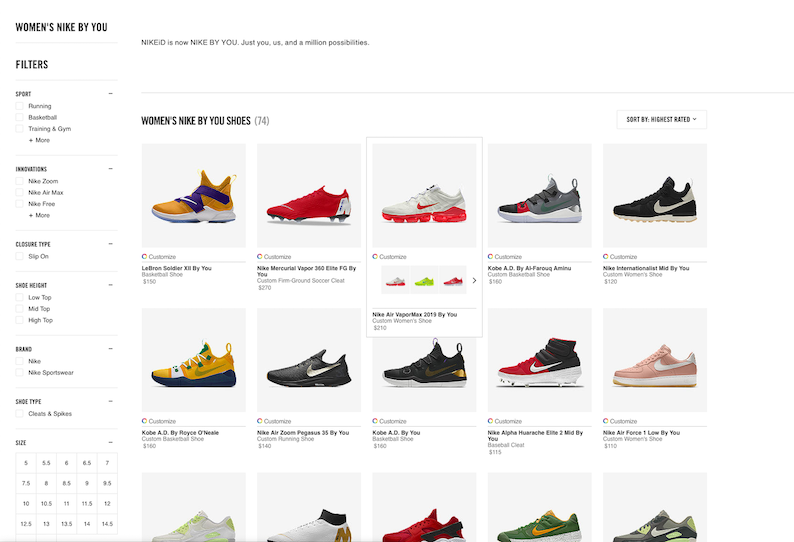
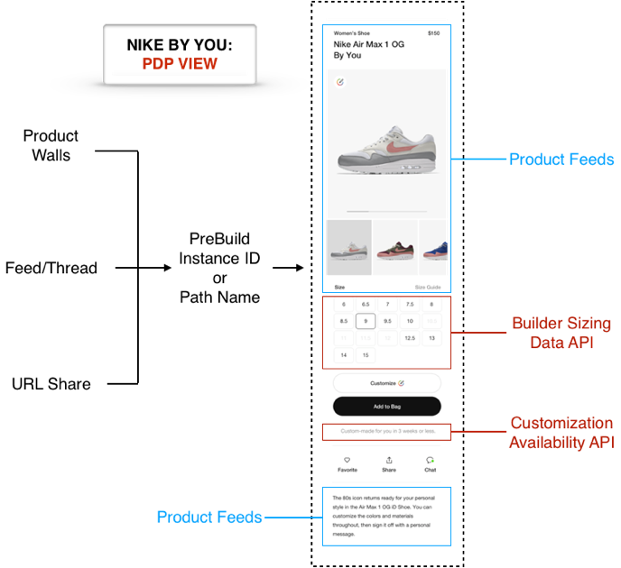

## Show Customizable Products

**Which products are customizable? How do I start designing?**

### Step 1: Load the Builder

Load the Builder and interact with the API to help drive the product browsing experience. Later, you can [Show a Design Experience](https://developer.niketech.com/docs/projects/Commerce%20Docs/Builder%20Reference/Show%20a%20Design%20UX) and [Enable Purchasing](https://developer.niketech.com/docs/projects/Commerce%20Docs/Builder%20Reference/Enable%20Purchasing) without having to first load the Builder.

**Load the Builder by invoking the `nikeIdBuilder(rootElement, config)` function.**

- In the `pathName` property of the `config` argument, use the value in `objects.productInfo.customizedPreBuild.legacy.pathName` from the Product Feeds response, like `pathName: 'af1LowChampsSU19'`.

- Use [`bridge`](https://developer.niketech.com/docs/projects/Commerce%20Docs/Builder%20Reference/Builder%20API#bridge-properties), a property of the `config` parameter, to listen for events coming back from the Builder.
    
    **Example (loads the Builder and logs a few things):**
        
    ```html
    <script>
    const builderApi = nikeIdBuilder(document.getElementById('nikeid-app'), {
      'nike-api-caller-id': 'com.nike:commerce.b16.localhost',
      pathName: 'FUTUREELITEFA18',
      fetchCapacity: true,
      sizeTypeRegion: 'US',
      bridge: {
        onProductLoad: function(buildData) {
        // Builder is ready
        console.log('Set Size Answer',builderApi.setSizeAnswer('FUTUREELITEFA18:LTITEM8538:LTITEM8112:LTITEM8010:LTITEM403108','LTITEM8132','us-mens'));
        },
        onError: function(error) {
          console.error(error);
        },
        onDone: function(buildData) {
        // Consumer selected Done button
          console.log('Done:',buildData);
        },
        onPriceUpdate: function(priceData) {
        // Customization selections have changed the product price
          console.log('Price Update:',priceData);
        }
      }
    })
    </script> 
    ```

    >**TIP**: See [Quick-Start: Load the Builder](https://developer.niketech.com/docs/projects/Commerce%20Docs/Using%20Customization/Quick-Start) and [Customization Builder Reference](https://developer.niketech.com/docs/projects/Commerce%20Docs/Builder%20Reference) for more details about the Builder.

### Step 2: Show Customizable Products & Color Options

Whether it's a [Nike By You](https://www.nike.com/us/en_us/c/nikeid) web experience with it's product grid walls and Product Detail Pages (PDPs), or some other type of experience, you need to show the consumer which products, and in what colors, can be customized.



**Get a list of customizable products, along with relevant content.**

- Call either the [Product Feeds API]() or the [Rollup Threads API]() 
- To select only 'Nike By You' products, use the `filter=attributeIds()` query parameter like:

    https://api.nike.com/product_feed/threads/v2?filter=channelId(d9a5bc42-4b9c-4976-858a-f159cf99c647)&filter=marketplace(US)&filter=language(en)&filter=attributeIds(92be6a0f-24dd-4e2e-87d0-5ce4ade3a923.

**Use the response data to drive the experience of browsing customizable products (grid wall, feed, etc.).**

>**TIPS**:
>- [Rollup Threads]() is best for displaying a grid wall, where alternate colors are shown with each product in the grid.
>- See [Adding Rollup Threads to Your Experience]() and [Adding Product Feeds to Your Experience]() for more integration info.
>- See [TTAC]() for more about the benefits of using taxonomy tagging.

### Step 3: Show a PDP for a Customizable Product

Show the consumer a particular product in more detail with a PDP like:



Next, we'll discuss some components that you can include in a PDP.

#### Step 3a: Show Product Content and Info

Show the product images, pricing, and other info from [Product Feeds]() on the PDP.

- Call the [Product Feeds API]() with the thread id to retrieve content and info for the product.

#### Step 3b: Show 'Edit Design' CTA

Show the consumer a way to edit the design.

**Display an 'Edit Design' CTA (call-to-action) button that launches the Builder UX**

- Example button code using [NCSS](https://tourguide.prod.commerce.nikecloud.com/ncss):
    ```html
    <button class="ncss-btn-primary-dark">Edit Design</button>
    ```
    <button style="margin-top: 5px; margin-bottom: 5px;" class="ncss-btn-primary-dark">Edit Design</button>

>**TIP**: It's recommended for the 'Edit Design' CTA to be always active on the PDP.