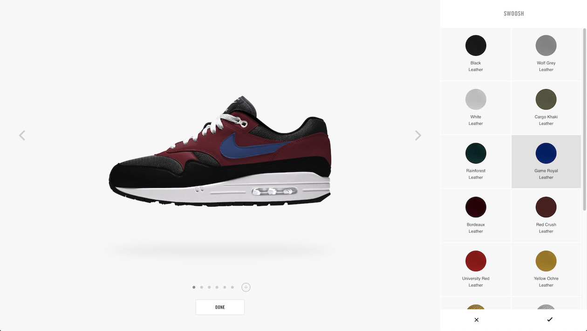

# ADDING CUSTOMIZATION TO YOUR EXPERIENCE

##### Last Updated: 08/31/2020

The **Customization Experience Platform (CXP)** unlocks your ability to add premium product customization features to your experience, similar to [Nike By You](https://store.nike.com/us/en_us/pw/nikeid-air-max-shoes/oolZb8dZoi3):

>**TIP**: Before using this guide, you should have already completed [Customization Overview](https://developer.niketech.com/docs/projects/Commerce%20Docs/Customization).

## Introduction

In this guide, we will discuss how to integrate CXP customization features into your app. First, what does CXP have to offer?

### Builder Bundle

The Builder Bundle is a JavaScript bundle (known as B16) that is your main interface with CXP.

Users of B16 have two adventure options:

- **Full Bundle**: Includes access to the fully-styled UX for customizing products
- **Headless or Builder API**: Allows you to interact with Builder methods and associated JS APIs where customization business logic is housed so that you can build your own experience.

### REST APIs

In addition to the Builder, the Customization Domain offers a variety of [REST APIs](https://developer.niketech.com/?domains=Customization) that can be used for specific steps along the user journey.

###### Table 1:  Customization APIs and What They Do

|Service Name|What does it do?|
|---|---|
|Consumer Designs|Returns the entire payload of a consumer design for rendering in experiences.|
|Design View|Returns a subset of consumer design data for rendering in experiences.|
|Image Redirect (for a consumer design)|Returns a full Scene7 Render URL to display a consumer’s design image. Also includes optional parameters for image view, size, and redirect proxy (for legacy clients).|
|Bill of Materials|Returns the factory-facing design elements of the consumer’s design.|
|Inspiration Designs|Returns the entire payload of an inspiration design for rendering in experiences.|