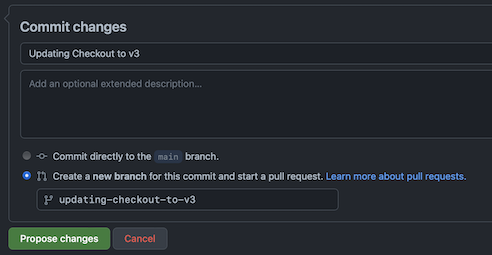

# Contributing to the Docs

Do you want to contribute to Commerce Docs?
Read on to find out how you can have a positive impact on developer experience!

## Step-by-Step

To edit existing content on the Commerce Docs site,
follow the instructions below.

1. Notify the Tech Docs team what you will be contributing. 
   - Slack the [#tech-docs](slack://channel?team=T0G3T5X2B&id=C6A18NT7W) channel or use the feedback button available on every page on the site
   - Filling out the feedback form creates a Jira ticket on the API Docs board
2. Go to the [techdocs.site GitHub repo](https://github.com/nike-internal/techdocs.site) and open the Markdown (.md) file that you want to edit
3. Click the pencil button to enter the Editing mode
4. Make your changes to the file using [Markdown](https://www.markdownguide.org/cheat-sheet/) syntax
   and the standards outlined in our
   [Doc Style Guide](https://confluence.nike.com/display/APID/Tech+Docs+Style+Guide).
   - Optionally, toggle to the Preview tab to see an HTML preview with basic styling before you submit your changes
5. Scroll down to the 'Commit changes' dialog, then select 'Create a new branch for this commit and start a pull request'
6. Add a commit name and a branch name that explains the changes you are making, e.g. "Updating Checkout v3" and "updating-checkout-to-v3"

   

7. Click 'Propose changes' to submit your pull request. Some considerations:
   - There's no need to add PR reviewers; the Tech Docs team is assigned by default
   - When everyone is satisfied with the changes, the team approves the PR and merges them into the codebase
   - Your changes publish immediately to the Commerce Docs site!

Thanks in advance for your contributions!
Please reach out on [#tech-docs](slack://channel?team=T0G3T5X2B&id=C6A18NT7W) if you need anything.