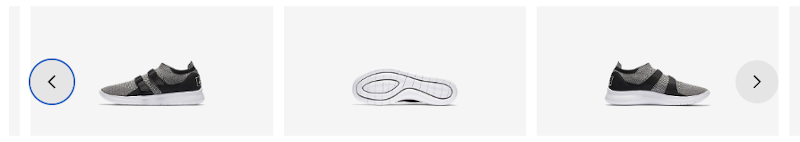

{:width="100%"}

## What is it?

Nike's Podium Consumer provides a scalable, flexible and responsive toolset that is used to standardize the look, feel and functionality of UI elements across Nike experiences. Podium Consumer achieves this by offering a comprehensive set of system (UI) components, design tokens and icons. It is recommended that all Nike commerce desktop and mobile web experiences adopt Podium Consumer.

**Podium Consumer components** are used to create simple or complex UI elements such as carousels, buttons and images. Components may contain one or more configurable `props` that represent HTML attributes.

**Podium Consumer design tokens** represent style values. For example, the web color token named `colorContentPrimary` represents the hex color value `#111111`. Design tokens are used by components behind-the-scenes, but you can also use them directly to override and customize style components.

**Podium Consumer icons** are available as React components through the @nike/nike-design-system-icons library. You can find a complete list of icons in both [Figma](https://www.figma.com/file/WHGv51Q14Zeq8XZ3Y6UIT3/Podium-DS-Icon-Library?node-id=0%3A25){:target="new-tab"} and the [Podium Consumer Storybook](https://nike-design-system.s3.amazonaws.com/storybook/production/latest/index.html?path=/story/icons-nike-design-system-icons--all-icons){:target="new-tab"}. If you can not find the icon you need, [request a new icon](https://www.figma.com/file/ry0cSgMD99gA9B3WXNWVvo/Podium-DS-Icon-Creation-Form?node-id=2%3A244).

## Can Podium Consumer be used with Web Shell?
Yes! The Podium Consumer component and design token libraries are automatically accessible in [Web Shell](https://super-bassoon-778bf849.pages.github.io/){:target="new-tab"} with no special configuration necessary. In order to use the icon library in your Web Shell project, you need add `@nike/nike-design-system-icons` to your Web Shell project manually.

The code script below sets the Podium Consumer button component using the design token `borderRadius` with a border width of value `buttonBorderRadiusS`.

```
import React from "react";
import { ButtonStyled, useTokens } from "@nike/nike-design-system-components";

export default function HomePage() {
  const { buttonBorderRadiusS } = useTokens();
  return (
    <div style= {{ borderRadius: buttonBorderRadiusS }} >
      <ButtonStyled>Click Me!</ButtonStyled>
    </div>
  );
}
```

## Where can I find out more?

|---|---|
|[Podium Consumer Storybook](https://nike-design-system.s3.amazonaws.com/storybook/production/latest/index.html?path=/story/intro-getting-started--page){:target="new-tab"}|Podium Consumer Storybook is a detailed guide to using the Podium Consumer component library with cut-and-paste code examples (including Beta). It also covers the design token library, icon library, v0 to v1 migration, hooks, and how to profile React components.|
|[Podium Component Demos](https://nike-design-system.s3.amazonaws.com/demos/production/latest/index.html){:target="new-tab"}|Experience how the Podium Consumer component library can be used to create feature-rich functionality such as product carousels, modals, dropdowns and form validation on this live demo site.|
|[Podium Website](https://podium.nike.com/#introContent){:target="new-tab"}|Visit the Podium website to learn how Podium Consumer, Podium Consumer Tools and Podium Enterprise play together to create "A System of Systems".<br>**Username**: PodiumDS (case-sensitive)<br>**Password**: PlayTogether (case-sensitive)|
|[Contributing](https://confluence.nike.com/display/TG/CoreUX+-+InnerSource+How+to+contribute+to+the+Nike+Design+System%3A+Squad+Supports+Contributions){:target="new-tab"}|Interested in contributing to Podium Consumer? Get the details on the team's InnerSource model in Confluence.|

#### Contacting the Podium Consumer team:

|---|---|
|Slack|[#podium_design_system](slack://channel?team=T0G3T5X2B&id=CK1A5TXQA)|
|Confluence Space|[Podium Component](https://confluence.nike.com/display/PDS/Podium+Design+System){:target="new-tab"}
|Product Owner|[gayla.hilton@nike.com](mailto:gayla.hilton@nike.com)|

### Connect

The Tech Docs team is here to help with your doc needs. Reach us through &nbsp;<i class="g72-chat"></i> [#Slack](slack://channel?team=T0G3T5X2B&id=C6A18NT7W)&nbsp;&nbsp;&nbsp;<i class="g72-email"></i> [Email](mailto:Lst-nde.docs@nike.com) or click the Provide Feedback button in the lower right corner.