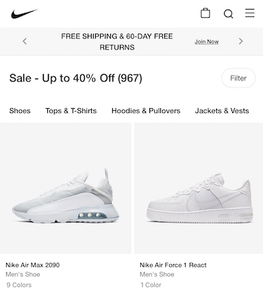

# {{ page.title }} <i style="float: right;" class="g72-swoosh"></i>
###### Last Updated: 03/05/2021
###### Tags: {{ page.tag }}

---

1-2 sentence intro to set context for this doc, and the domain it describes.

##  Integration Overview

Use pictures and concise sentences (or bullets) to describe how to integrate with (or use) this thing.

## Use Cases

Step through the use cases below to integrate this thing into your experience.

|---|
|<i class="g72-check"></i>&nbsp;&nbsp;[Do Stuff]({{ "/doc/templates/sample-use-case.html#use-case-1" | absolute_url }}) Do some stuff, blah blah blah|
|<i class="g72-check"></i>&nbsp;&nbsp;[Do Things]({{ "/doc/templates/sample-use-case.html#introduction" | absolute_url }}) Do some things, blah blah|

>**TIP**: See [Use Case Guide]({{ "/doc/sample-use-case.html" | absolute_url }}) for full integration details.

### Next Steps

- [Blueprint Guide]({{ "/README.html" | absolute_url }}): Learn how to use this blueprint

### Connect

We're here to help.&nbsp;&nbsp;&nbsp;<i class="g72-chat"></i> [Slack](slack://)&nbsp;&nbsp;&nbsp;<i class="g72-email"></i> [Email](mailto:)