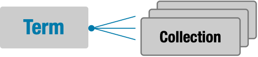
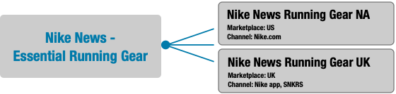
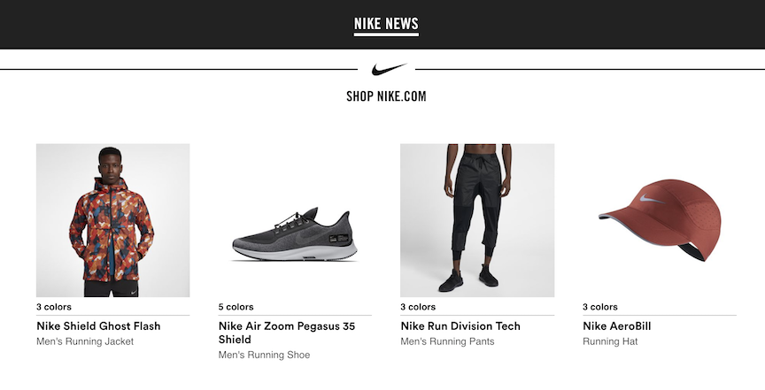
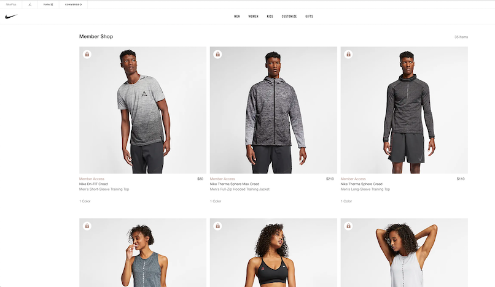
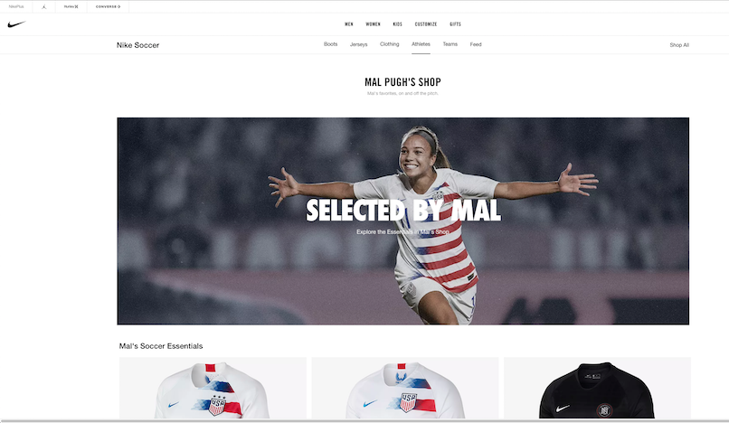
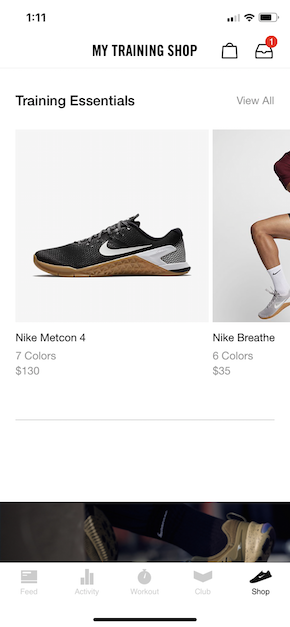

<a href="{{ page.url | replace: '.html','.pdf'}}" target="blank" class="ncss-btn-secondary-grey guide-button float"><i class="fas fa-arrow-alt-circle-right"></i> DOWNLOAD</a>

# ADDING COLLECTIONS <br>TO YOUR EXPERIENCE (DRAFT)

---

##### Last Updated: 11/10/2018

Add a custom set of products to your experience with Collections.

>**TIP**: Before using this guide, you should have already completed [Rollup Threads Developer's Guide](/doc/commerce/product/use-rollup-threads.html) and [Product Feeds Developer's Guide](/doc/commerce/product/use-product-feeds.html).

## What are Collections & Terms?

- **Collection**: a set of one or more [Product Threads](/doc/commerce/product/use-product-feeds.html#cards-threads-and-feeds), restricted to a combination of channels and marketplaces.

- **Term**: a set of one or more Collections that are related.



### Example

The Nike News team wants their NA and UK readers to be able to shop Nike.com products in one of their articles on news.nike.com. They create the following:

- **Term**: 'Nike News - Essential Running Gear'
- **Collections**: 'Nike News - Essential Running Gear NA', 'Nike News - Essential Running Gear UK'



Each Collection contains 4 related running products for a particular marketplace and channel combination, in this case, 'NA/Nike.com' and 'UK/Nike app/SNKRS'.

By calling the Rollup Threads API with the Term, selecting marketplace as US, display the following in their app:

{:class="border"}

>**TIP**: Each Collection can have different products if desired.

### Other Use Cases

**Nike.com Member Shop**


**Nike.com Mal Pugh's Shop**


**NTC app Training Essentials**


## Step 1: Create Terms & Collections

Terms and Collections are created in the [Collections admin app](https://adminops.prod.commerce.nikecloud.com/collectionsui/terms){:target="new-tab"}. See [Create a Collection](https://confluence.nike.com/display/APOLLO/Create+a+Collection) for a step-by-step guide.

Save the **Term UUID**, the unique identifier for the Term, e.g. `69c1f58b-c36b-45d6-b3bb-afb160c9ab0c`, since you will need it in [Step 3](#step-3-call-rollup-threads).

When you add Product Threads to a Collection, the Threads get automatically updated with that Collection's Term UUID. Then, you can get the Threads from the [Rollup Threads API](/doc/commerce/product/use-rollup-threads.html).

>**TIP**: It typically takes 5 minutes or less for changes to a Collection to become available in the Rollup Threads API.

## Step 2: Create Search Rule

This step is **OPTIONAL**. If you want to further customize a Collection, for example to change the sort order of the response from Rollup Threads, you can take the optional step of creating a Search Rule in the [Apollo admin app](https://adminops.prod.commerce.nikecloud.com/apollov1/).

## Step 3: Call Rollup Threads

Use the **Term UUID** obtained in Step 1 to call the [Rollup Threads API](https://developer.niketech.com/docs/projects/Product%20Feed%20Rollup%20Threads%20Service%20API%20V2?tab=api) with query parameter `filter=attributeIds(<term UUID>)`, along with other required or optional `filter` and `sort` query parameter values.

The Rollup Threads API response contains the requested product threads, which you can use to display products in your experience.

### Filtering by Channel & Marketplace

Channel and marketplace are both required parameters for Rollup Threads. Combine channel and marketplace combinations to apply another level of filtering to the Threads in the Term.

>**TIPS:**
>
><i class="mr2-sm g72-check"></i>See [API Endpoint Quick Reference](#api-endpoint-quick-reference) for endpoint details and links to API Reference documentation.
>
><i class="mr2-sm g72-check"></i>For more on syntax, see [Query Parameters](/doc/getting-started/using-nike-apis.html#query-parameters).

### Scenarios

Let's take a look at some scenarios.

|I want to...|Sample Query|
|---|---|
|Do this thing|`url to do this thing`|

### Executing the Request

Sample CURL for {}

```
CURL goes here
```

### Parsing the Response

The Rollup Threads response is specified in the [API Reference](https://developer.niketech.com/docs/projects/Product%20Feed%20Rollup%20Threads%20Service%20API%20V2?tab=api), but here's a few things to know about:

- Rollup Threads returns only active product threads. If you want inactive threads included in the response, call [Product Feeds Threads List](/doc/commerce/product/use-product-feeds.html#product-threads-list) instead.

{Some hints/callouts about the data in the response and how it could be handled}

## API Endpoint Quick Reference

|Endpoint Name|Path|HTTP Method|
|---|---|---|
|[Rollup Threads *List*](https://developer.niketech.com/docs/projects/Product%20Feed%20Rollup%20Threads%20Service%20API%20V2?tab=api){:target="new-tab"}|`/product_feed/rollup_threads/v2{?filter,anchor,count,sort,searchTerms,consumerChannelId,view,ruleStatus}`|GET|

## Best Practices

Listed below are some best practices for working with Collections.

### Common Questions

**Question 1**

Answer 1

## Contacting the Team

>**TIP**: To find out more, ask a question on [#collections](https://nikedigital.slack.com/messages/CA2EDLQ4X){:target="new-tab"}.

Need to contact the {} team?

|---|---|
|Slack|[](){:target="new-tab"}|
|Confluence Space|[](){:target="new-tab"}|
|Team Contacts|Person1 (Person1 email)|

## Document Change Log

|Summary |Date |Description|
|---|---|---|
|Initial draft 11/15/2018|Initial Draft|

## Next Steps

You've learned how to add Collections to your experience. Here are some next steps.

- [Capturing User Events](/doc/commerce/events/use-eventsv2.html)
- [Using Nike APIs](/doc/getting-started/using-nike-apis.html)
- [Glossary](/doc/commerce/reference/glossary.html)