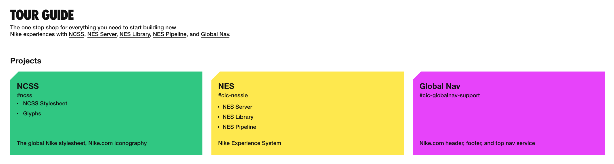

# UX Foundation Overview

---

UX Foundation offers products that solve common problems for hosted user experiences. The documentation is available on [Tour Guide:](https://tourguide.prod.commerce.nikecloud.com/){:target="blank"}

 

{:target="blank"}

### Products

|---|
|<i class="g72-check"></i>&nbsp;&nbsp;[NCSS:](https://tourguide.prod.commerce.nikecloud.com/ncss) The global Nike stylesheet|
|<i class="g72-check"></i>&nbsp;&nbsp;[Nike Experience Server:](https://tourguide.prod.commerce.nikecloud.com/nes) Adds localization, feature flags, styling, analytics, monitoring, and more|
|<i class="g72-check"></i>&nbsp;&nbsp;[Global Nav:](https://tourguide.prod.commerce.nikecloud.com/global-nav) Adds the latest global header/footer, search, and analytics|

### Connect

 We're here to help.&nbsp;&nbsp;&nbsp;<i class="g72-chat"></i> [#Slack](https://nikedigital.slack.com/messages/C9Q1MNJ1J){:target="blank"}&nbsp;&nbsp;&nbsp;<i class="g72-email"></i> [Email](mailto:developer.relations@nike.com)
