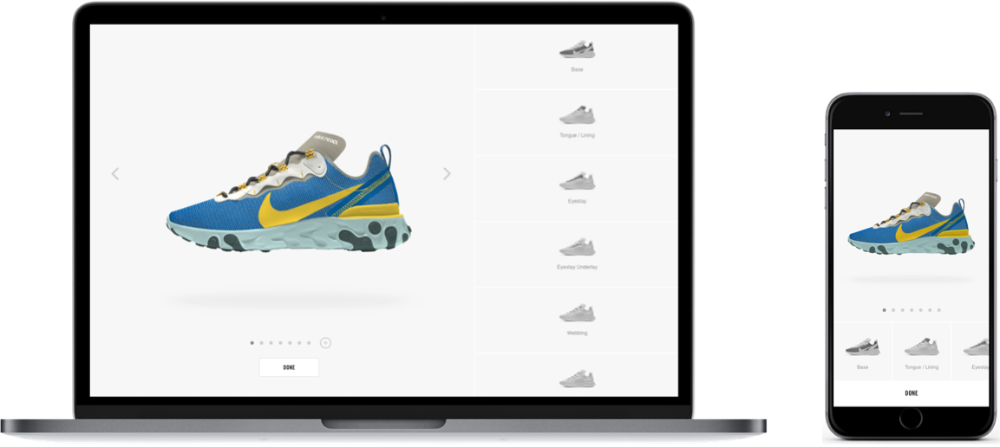

<a href="/doc/portal/overview-doc-team.html" style="display:inline-block;" class="ncss-btn-secondary-grey guide-button">Find out about our services!</a>
# <i class="g72-swoosh"></i>&nbsp;Documentation

---

    
    

    
ACCELERATE

    
Speed up your integration with Nike's APIs and other technology products using this collection of guides.
 
    

